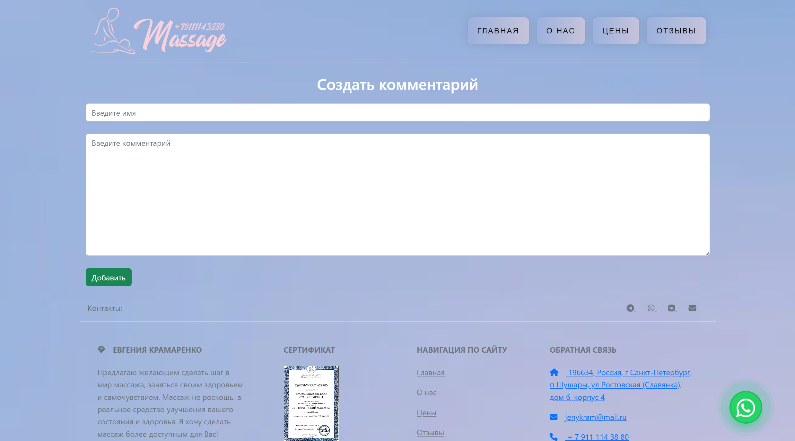

<h1 align="center">
Сайт для салона массажа</h1>

Сайт, позволяющий пользователям ознакомиться с услугами мастера, оставить отзыв и ответить на него.
Сайт состоит из 4 страниц:

# 
На данной странице пользователь может ознакомиться с каталогом услуг и ценами на них.

 &nbsp; &nbsp; 

# 
Вся необходимая информация о мастере массажа и о расположении салона.

 &nbsp; &nbsp; 

# 
Пользователь может в удобной форме выбрать нужную ему услугу.

 &nbsp; &nbsp; 

# 
В данном разделе пользователь может написать отзыв или ответить на чужой. Реализована рейтинговая система в виде звездочек.

 &nbsp; &nbsp;  

 &nbsp; &nbsp;  
# 
Дизайн лаконичен и понятен. Для удобства связи справа сницу находится кнопка связи в whatsapp. 
 &nbsp; &nbsp;  
 &nbsp; &nbsp; 
